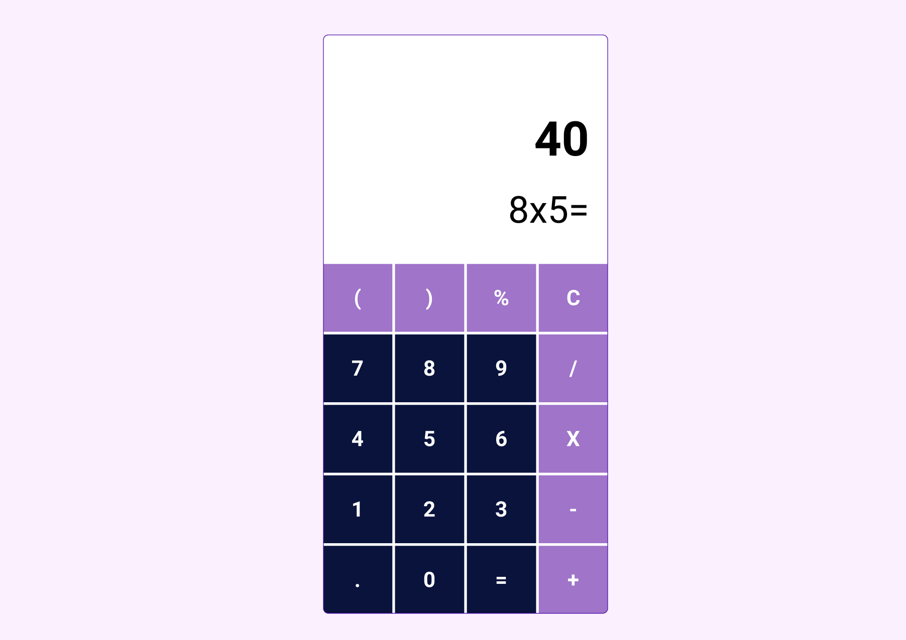

# Final Project

Design UI, below
  
DEADLINE: `23 oct, 2021 10:00 A.M`  

 

1. Your task is to design given task as it is. You have to make well designed calculator. 

2. Every button should be functional (adding, clearing, multipling...) 

3. Don’t use third party library. Use only HTML, CSS, JS  

4. You can choose different color combinations as you wish so ( Dark, blueLight, semi-dark) 

  
Source: [ demo ](https://www.figma.com/file/WyrY6XRfLO3WzmHhmj9nkc/Calculator?node-id=0%3A1)
